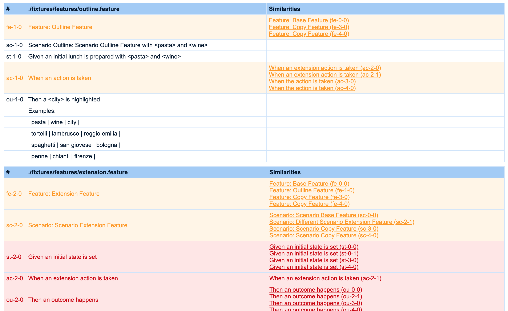
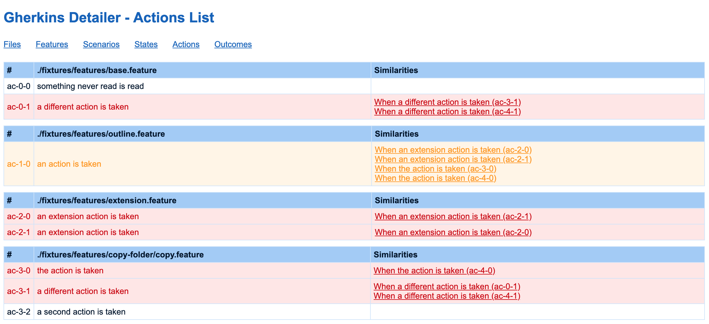

[](https://travis-ci.org/silversonicaxel/gherkin-detailer)
[](https://coveralls.io/github/silversonicaxel/gherkin-detailer?branch=master)

# gherkin-detailer
gherkin-detailer is a tool that checks the gherkin files included in you project and:
* list them per type - _to create a general total overview_
* highlight similarities - _to prevent duplication of code for similar situations_

## Documentation
* [Summary](SUMMARY.md)
* [Gitbook](https://silversonicaxel.gitbook.io/gherkin-detailer/)

## Introduction
gherkin-detailer is a tool that generates HTML reports related to the gherkins that are part of the project you are working on. Currently there are six sections available:
* Files list (containing the entire list of all the detailed scenarios)
* Features list (containing the simple list of all the features)
* Scenarios list (containing the simple list of all the scenarios and scenarios outlines)
* States list (containing the simple list of all the **given** - states)
* Actions list (containing the simple list of all the **when** - actions)
* Outcomes list (containing the simple list of all the **then** - outcomes)

Every detail of every section has a background color that highlight potential similarities across the gherkins that might hide duplication of code within the project.

## Examples

This first example shows the Files section, and it lists the entire gherkins in all _*.feature_ files. This page is the perfect documentation for the project, separated per file and describing all specific use cases.

The colour shows extra information.
* The red ones show the equal elements of every gherkins, so the developer should immediately understand that those sentences (actions, outcomes, scenarios, etc...) represent always the same entity and that there should be just one specific code associated to them all.
* The orange one show the similar elements of every gherkins, so the developer should eventually check if those similarity are correct and really represent different entity with different associated code, or maybe they might hide some errors and duplication of code.

---


The second example shows the Actions section, and it lists all the actions

The menu help the developer to navigate to Files to have a general overview of all the gherkins of the project, or could chose specific elements of every gherkins, from Features to Scenarios, from States to Actions and Outcomes.


## Requirements
* node 10.12+
* npm 6.0+

## Installation
gherkin-detailer can be installed as a global tool:

```bash
$ npm install -g gherkin-detailer

$ yarn global add gherkin-detailer
```

or as a devDependency:

```bash
$ npm install -D gherkin-detailer

$ yarn add --dev gherkin-detailer
```

## Usage
If you've installed it as a devDependency, you need to add it in the `script` section of the `package.json`.

To execute it with all default options, so to let its analysis starts from the current folder, set this up:
```bash
"gherkin-detailer": "gherkin-detailer"
```

To customize the analysis folder, set this up:
```bash
"gherkin-detailer": "gherkin-detailer -a './src/'"
```

To customize the output folder, set this up:
```bash
"gherkin-detailer": "gherkin-detailer -o './report/'"
```

To customize the report theme, set this up:
```bash
"gherkin-detailer": "gherkin-detailer -t 'black'"
```


Then the `gherkin-detailer` can be executed in order to have a gherkins report created in a default folder `./report/gherkin-detailer/`

```bash
$ npm run gherkin-detailer

$ yarn gherkin-detailer
```

## Help
```bash

$ gherkin-detailer --help

Usage: gherkin-detailer [options] <option>

  Options:

    -v, --version                           Output the version number
    -a, --analysis [analysis]               Select folder to analyse
    -o, --output [output]                   Select folder to output
    -t, --theme [theme]                     Select report theme (white|black)
    -h, --help                              Output usage information

```
